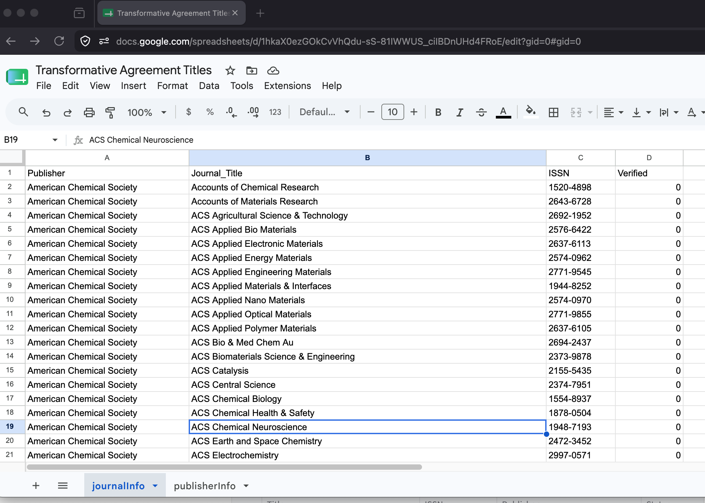
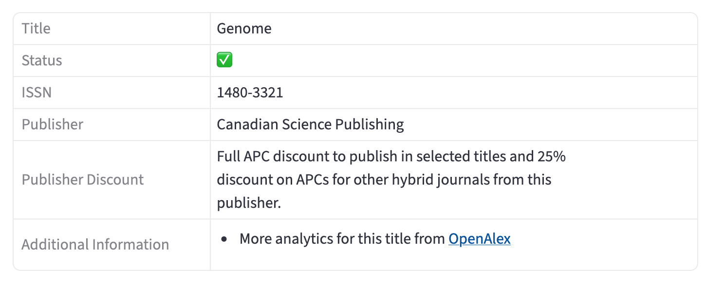
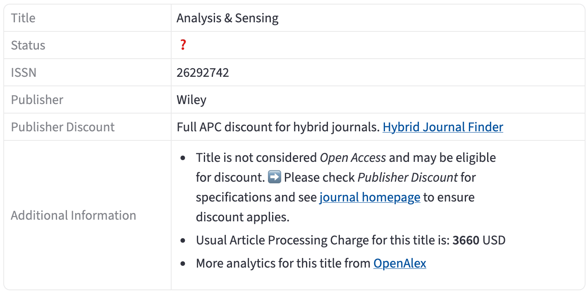
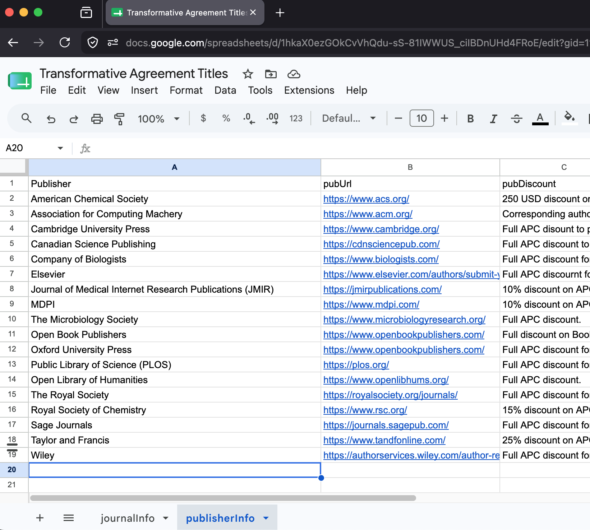
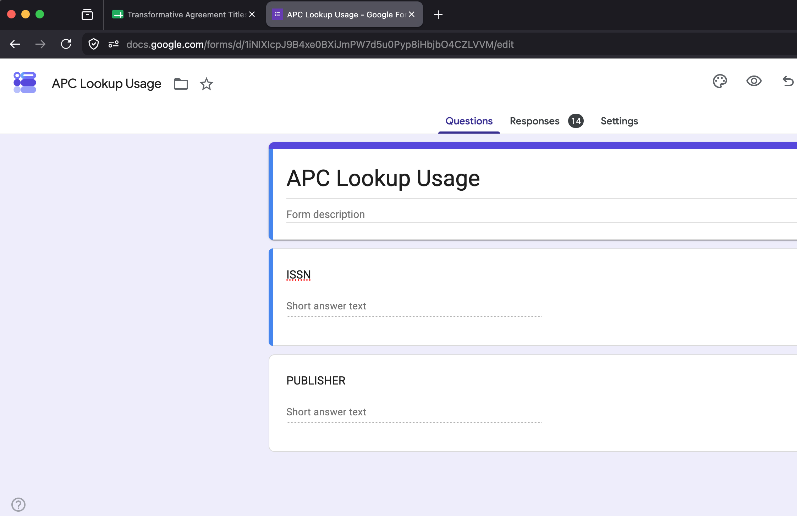
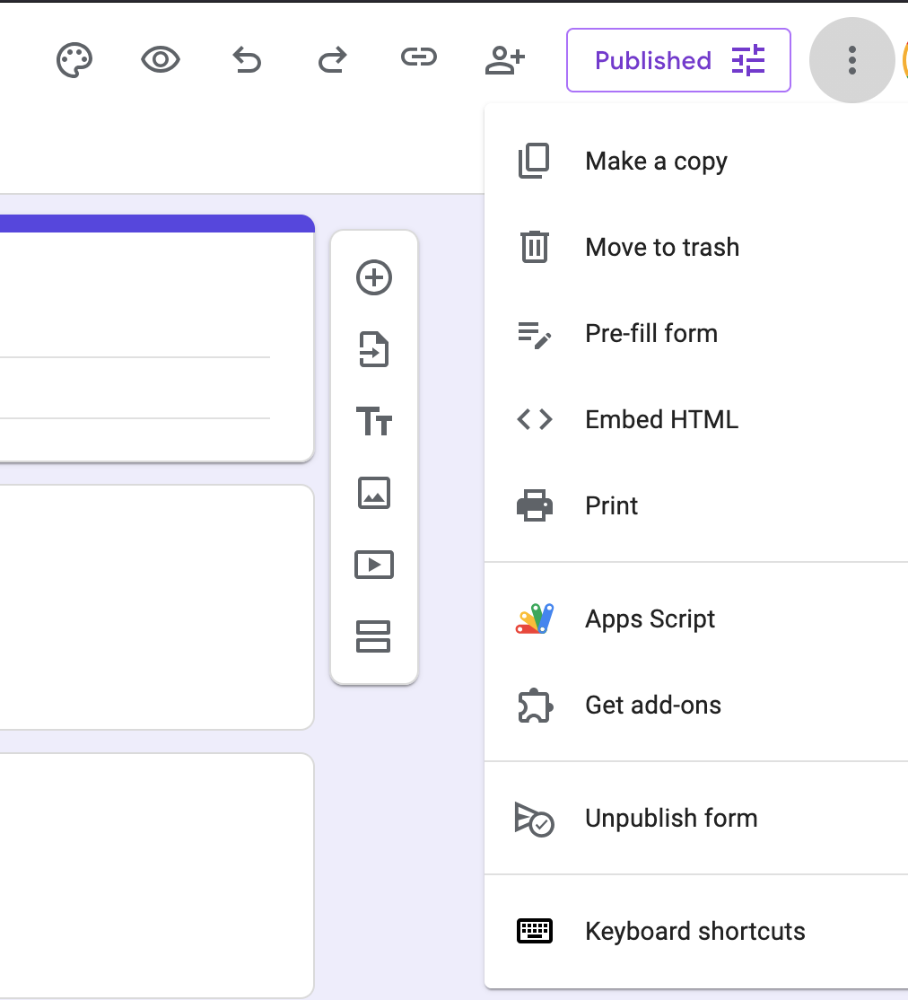
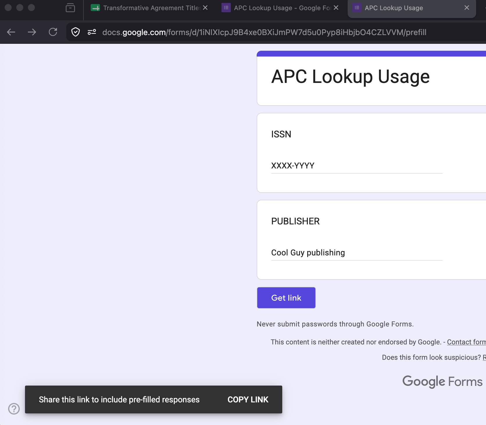

# apc details


A Streamlit app that will take a Google Sheet of information about Article Processing Charges (APC) waivers and discounts, and present that to end users in an appealing way. You are free (and encouraged) to make a version of this platform for your institution.

A list of journals and publishers is presented to the end user. The user can click on a publisher to only see titles from that provider. The user can also click on a journal title to retrieve more dynamics about that title from [OpenAlex](https://openalex.org/).

Check out Brock Library's instance of the app: [https://brock-apc-info.streamlit.app/](https://brock-apc-info.streamlit.app/) to see it in action.


The design philsophy for this platform is very much inspiried by Collection Builder, particularly [CB-Sheets](https://collectionbuilder.github.io/sheets/). You can run the whole thing without installing anythin on you local machine. Data goes in a Google Sheet, the app is deployed to Streamlit Cloud. Easy, peasy.


This video will explain how the platform works and a quick look at how to run it yourself.


----

📀 VIDEO DEMO 📀

----

## In short

- To present the data you create a Google Sheet 
 - with a tab for you publisher details
 - with a tab for the mapping between publisher & journal title / issn & a verified boolean

- To log usage you create a Google Form, with two text fields: ISSN & Publisher


- You _clone_ the github repository, modify some values & and add your own logo


- You create an app on streamlit cloud with your completed GitHub repository


## Setting up your own


### Google Sheets

- Make a new sheet with two tabs: _journalInfo_ & _publisherInfo_ with columns exactly like in the images, adding in your rows of data


#### journalInfo tab



- _Publisher_ - should be spelt exactly how it is written on _publisherInfo_, this is the match point
- _Journal\_Title_
- _ISSN_
- _Verified_ - Set this to `1` if you know for a fact this title is covered under you APC agreement, `0` otherwise.

When set, **Publish to the Web** -> just this tab -> as CSV -> Make a note of the URL


#### A note about the Verified column!
Sometimes you'll get title lists from a publisher that cover all of their titles, not just ones you know you have APC waiver or discounts for. For the titles from a publisher you are absolutely sure are covered in your deal use the value `1` in that column. For a title that are not confident is included in your deal, use the value `0`. When the system presents a **verfied** title it will show you exactly what the publisher agreement is. For titles that are not **verified** you'll see a message of what the publisher deal usually is, along with OpenAlex data and an encouragement to double check. Alas, if only this information was always correct. Some examples:


_When confident in the title_



_Not so much_



#### publisherInfo Tab



- _Publisher_ - should be spelt exactly how it is written on _journalInfo_, this is the match point
- _pubURL_ - URL of the homepage of the publisher
- _pubDiscount_ - Description of the discount / waiver, you can use [markdown](https://www.markdownguide.org/) here

When set, **Publish to the Web** -> just this tab -> as CSV -> Make a note of the URL

### Google Form

The platform will log to a Google Form everytime someone looks up more information about an ISSN, or when someone wants to look up more details on a publisher. To set that up you need to create the form with two short text fields like in the picture.



You should probably have the form add results to a Google Sheet so you can look line by line. Once this form is setup, you need to determine 3 things. The URL of the form, and the two entry 'keys' that the form uses.

Under the 3 dot menu is 'Pre-fill' form.



Select that and fill in some temp values then click* *Get Link* and *COPY LINK*



You'll get something along the lines of the following:

```
https://docs.google.com/forms/d/e/1FAIpQLSe61TNpD96WMGonWeV-w0nkvQjGRCfKaB6qsFmzQQXXXXXXXX/viewform?usp=pp_url&entry.192508000=XXXX-YYYY&entry.789120000=Cool+Guy+publishing
```
The three values are:

- form url, the part up to the `/` before the viewform. eg. `https://docs.google.com/forms/d/e/1FAIpQLSe61TNpD96WMGonWeV-w0nkvQjGRCfKaB6qsFmzQQXXXXXXXX`
- the entry value for the ISSN field eg. `entry.192508000`
- the entry value for the Publisher field eg. `entry.789120000`


### Github (To still be completed)

GH Will allow you to host all of your app code so that it can be deployed to the Streamlit service.

- Clone the repository
- Modify `src/index.py` to change the few variables at the top of the file.

|Variable| Purpose
|----|-----|
|PUB_URL| The link to the csv file shared from the _publisherInfo_ sheet|
|JOURNAL_URL | The link to the csv file shared from the _journalInfo_ sheet tab
|L_URL | The link to the form URL from the Forms step, with `/formResponse` added to the end of it |
|ISSN_ENTRY | The entry value for the ISSN field from the Forms step |
|PUBLISHER_ENTRY | The entry value for the PUBLISHER field from the Forms step |
|PREAMBLE | Whatever lead-in text you'd like at the top of the app, you can use [markdown](https://www.markdownguide.org/) here|
|HELP_MESSAGE| Whatever text you'd like at the bottom of the app, you can use [markdown](https://www.markdownguide.org/) here|
|LOGGING | Set this to `True` if you want the app to log to the Google Form. You can set this to `False` if you don't want to do this. (You might want to shut this off for example while you are testing your setup or modifying the app.) |
|IMAGE_PATH | The path to your image file if you want to have it named something else for example. It defaults to `images/logo.png` and is set for a size of 200px |

### Deploy to Streamlit Cloud (To still be completed)

- Head to [Streamlit cloud]()
- New app
- Connect to Github
- find the url of your forked repository


## Tweak it more? (Optional) (To still be completed)

You can do everything you need to do run an instance of this without installing anything and just by visiting a few sites and setting up accounts. You can of course clone the repository, [install steamlit](https://docs.streamlit.io/get-started/installation) and modfiy things even more. Here's the general steps to get your local setup going.

```
git pull <GH URL>
cd apc-details
source .venv/bin/activate
streamlit run src/index.py
```

Then edit `index.py` in a text editor of your choice. Streamlit should automatically render your changed app.