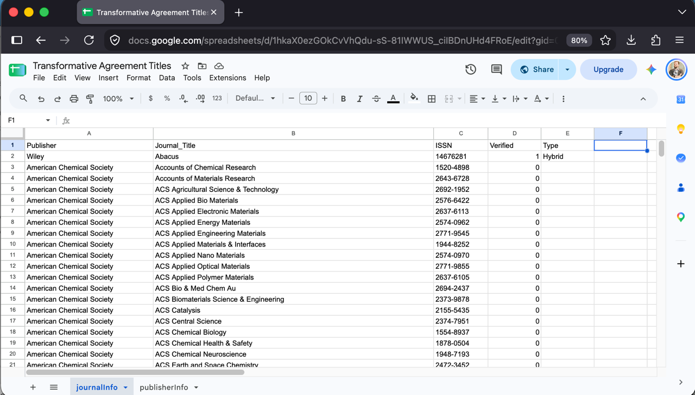
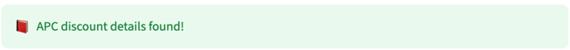
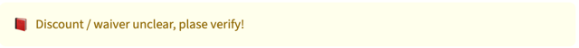
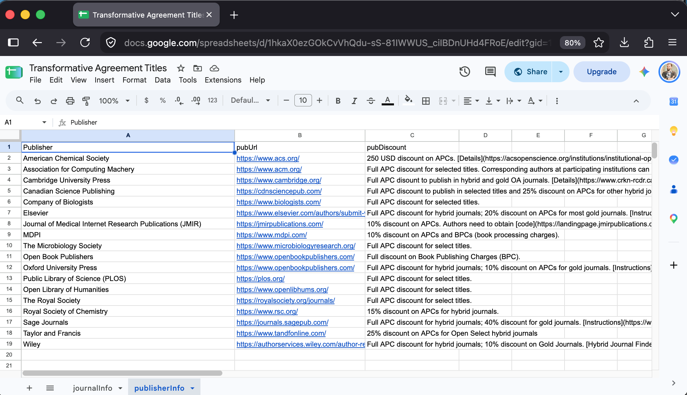
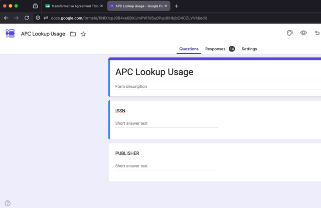
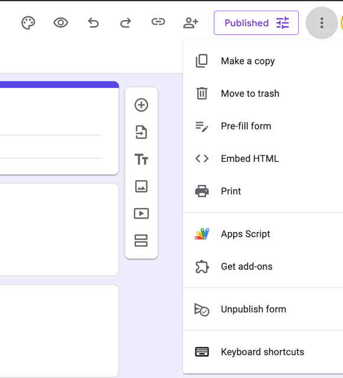
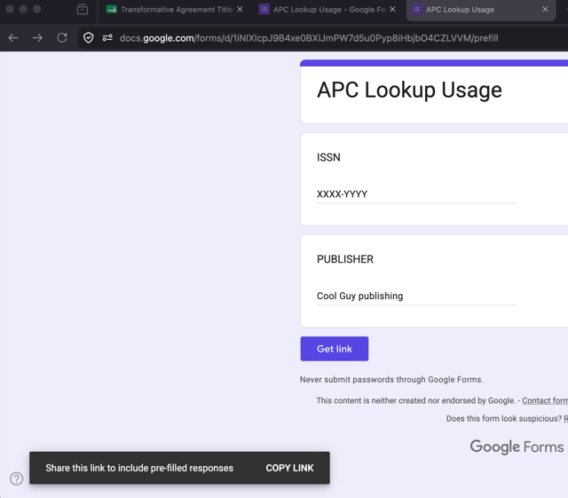

# apc details


```
                              .___      __         .__.__          
   _____  ______   ____     __| _/_____/  |______  |__|  |   ______
   \__  \ \____ \_/ ___\   / __ |/ __ \   __\__  \ |  |  |  /  ___/
    / __ \|  |_> >  \___  / /_/ \  ___/|  |  / __ \|  |  |__\___ \ 
   (____  /   __/ \___  > \____ |\___  >__| (____  /__|____/____  > 
        \/|__|        \/       \/    \/          \/             \/ 

```


A Streamlit app that will take a Google Sheet of information about Article Processing Charges (APC) waivers and discounts, and present that to end users in an appealing way. You are free (and encouraged) to make a version of this platform for your institution.

A list of journals and publishers is presented to the end user. The user can click on a publisher to only see titles from that provider. The user can also click on a journal title to retrieve more dynamics about that title from [OpenAlex](https://openalex.org/).

Check out Brock Library's instance of the app: [https://brock-apc-info.streamlit.app/](https://brock-apc-info.streamlit.app/) to see it in action.


The design philsophy for this platform is very much inspiried by Collection Builder, particularly [CB-Sheets](https://collectionbuilder.github.io/sheets/). You can run the whole thing without installing anything on you local machine. Data goes in a Google Sheet, the app is deployed to Streamlit Cloud. Easy, peasy.


This video will explain how the platform works and a quick look at how to run it yourself.


----

📀 VIDEO DEMO 📀

----

## In short

- You create a Google Sheet, with two tabs outlining publisher and title information (described next)

- To log usage you create a Google Form and make note of some values

- You _clone_ the github repository

- You add your details into a config file, upload a new logo image

- You create an app on Streamlit cloud with your completed GitHub repository


## Setting up your own


### Google Sheets

- Make a new sheet with two tabs: _journalInfo_ & _publisherInfo_ with columns exactly like in the images, adding in your rows of data


#### journalInfo tab



- _Publisher_ - should be spelt exactly how it is written on _publisherInfo_, this is the match point
- _Journal\_Title_ - The title the way you want it presented to the end user
- _ISSN_ - The eISSN is preferred but the API calls this is used for should work with either.
- _Verified_ - Set this to `1` if you know for a fact this title is covered under you APC agreement, `2` if you know for sure the discount does not apply, and `0` if you are unsure.
- _Type_ - A text description of what type of journal this title is. Eg. `Hybrid`, `Gold` etc.

When set, _File -> Share -> Publish to Web -> just this tab -> as CSV_ Make a note of the URL


#### A note about the Verified column!
Sometimes you'll get title lists from a publisher that cover all of their titles, not just ones you know you have APC waiver or discounts for. 

- For the titles that you are unsure of use the value `0`
- For the titles from a publisher you are absolutely sure are covered in your deal use the value `1` in that column. 
- For titles that are you confident are not included in your deal, use the value `2`. 

When you are looking at an actual journal title there will be a colour banner indicated this status, along with some additional diagnostic information.







#### A note about the Type column
The information here is used in the presentation of information to the end user. For example if the title is **Hybrid** you can add it here, so when the users sees the publisher discount description they can match it against the **Hybrid** label. This column value can also be empty if you don’t know the status. The imagine below shows and example of this.


#### publisherInfo Tab



- _Publisher_ - should be spelt exactly how it is written on _journalInfo_, this is the match point
- _pubURL_ - URL of the homepage of the publisher
- _pubDiscount_ - Description of the discount / waiver, you can use [markdown](https://www.markdownguide.org/) here

When set, _File -> Share -> Publish to Web -> just this tab -> as CSV_ Make a note of the URL

### Google Form

The platform will log every time someone looks up more information about an ISSN, or publisher. This is kept in a Google Sheet that is a response to a Google Form. To set that up you need to create the form with two short text fields like in the picture.



You need to have the form add results to a Google Sheet so you can look line by line. Once this form is setup, you need to determine 3 things. The URL of the form, and the two entry 'keys' that the form uses.

Under the 3 dot menu is 'Pre-fill' form.



Select that and fill in some temp values then click* *Get Link* and *COPY LINK*



You'll get something along the lines of the following:

```
https://docs.google.com/forms/d/e/1FAIpQLSe61TNpD96WMGonWeV-w0nkvQjGRCfKaB6qsFmzQQXXXXXXXX/viewform?usp=pp_url&entry.192508000=XXXX-YYYY&entry.789120000=Cool+Guy+publishing
```
Make a note of three values:

- form url, the part up to the `/` before the viewform. eg. `https://docs.google.com/forms/d/e/1FAIpQLSe61TNpD96WMGonWeV-w0nkvQjGRCfKaB6qsFmzQQXXXXXXXX`
- the entry value for the ISSN field eg. `entry.192508000`
- the entry value for the Publisher field eg. `entry.789120000`


### Github (Under construction)

Streamlit can look directly at a GitHub repository to deploy an app. You’ll need to have an Streamlit Cloud account, as well as a GitHub account. You’ll close the repository, configure your app in your repository, and finally tell Streamlit to deploy your app

- Clone the repository
- Modify `src/config.py` to change the few variables at the top of the file.

|Variable| Purpose
|----|-----|
|PUB_URL| The link to the csv file shared from the _publisherInfo_ sheet|
|JOURNAL_URL | The link to the csv file shared from the _journalInfo_ sheet tab
|L_URL | The link to the form URL from the Forms step, with `/formResponse` added to the end of it |
|ISSN_ENTRY | The entry value for the ISSN field from the Forms step |
|PUBLISHER_ENTRY | The entry value for the PUBLISHER field from the Forms step |
|PREAMBLE | Whatever lead-in text you'd like at the top of the app, you can use [markdown](https://www.markdownguide.org/) here|
|STATUS_DESCRIPTION| Text to explain the status icons |
|PUBLISHER_LEADIN| Text to introduce the publisher information table |
|APC_INFO| Text of 'more information' expander |
|HELP_MESSAGE| Whatever text you'd like at the bottom of the app, you can use [markdown](https://www.markdownguide.org/) here|
|LOGGING | Set this to `True` if you want the app to log to the Google Form. You can set this to `False` if you don't want to do this. (You might want to shut this off for example while you are testing your setup or modifying the app.) |
|IMAGE_PATH | The path to your image file if you want to have it named something else for example. It defaults to `images/logo.png` and is set for a size of 200px |

### Deploy to Streamlit Cloud (To still be completed)

- Head to [Streamlit cloud]()
- New app
- Connect to Github
- find the url of your forked repository

## Upgrading and modifying apc-details

First make a back-up copy of `src/config.py` by copying it somewhere safe.

### Web only
If you just use github in the web interface you should probably just clone the repository fresh. Add your values into `src/config.py` from your back-up copy of the file and go through the _Deploy to Streamlit Cloud_ section with your new repository.


### Using Github Desktop or GitHub CLI
git `pull` the new version of the repository. Add your values into `src/config.py` from your back-up copy of the file. git `commit` then `push` as usual and your app should restart


## Tweak it more? (Optional)

You can do everything you need to do run an instance of this without installing anything and just by visiting a few sites and setting up accounts. You can of course clone the repository, [install steamlit](https://docs.streamlit.io/get-started/installation) and modfiy things even more of you are comfortable with programming in Python. 

Here's the general steps to get your local setup going. (Using SSH for git)
```
git clone git@github.com:elibtronic/apc-details.git
cd apc-details
source .venv/bin/activate
streamlit run src/index.py
```

Then edit `index.py` in a text editor of your choice. Streamlit should automatically render your changed app on the machine, available via [https://localhost:8501](https://localhost:8501)

To update your app, simply push your changes to GitHub. If you add in some fun additional feature please submit a Pull Request.